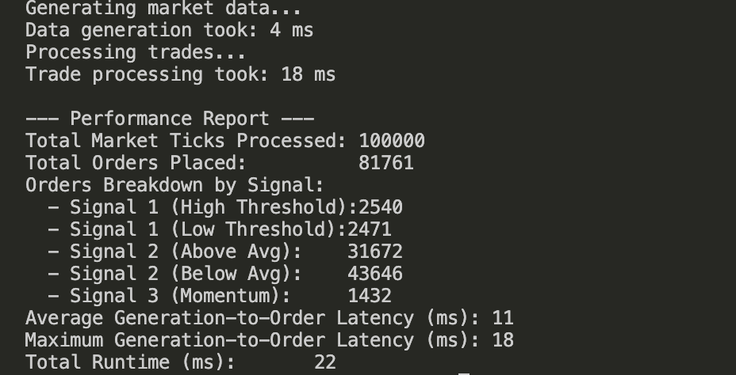

### Console output

### Write-up

From our console output, we can see that signal 2 produced the most orders by far, comprising over 75,000 of the roughly 81,000 orders placed by the program in total. The majority of these orders were placed by the signal indicating a buy (price below average).

As for potential optimizations, there are a few things that could be experimented with to possible provide better performance. For example, some of the simpler functions could be inlined explicitly, like evaluateSignal1, which is a short and simple function that only checks a couple of conditions but is called for every tick. Additionally, tracking which signal contributed to each order can become expensive at scale, especially when using vectors like we have in our code, which will have to perform large memory copies when our history becomes very large. This can be remedied by preemptively allocating a large chunk of memory if we know a range of how large our data can become. An example of this is using the reserve() method for vectors, which we've employed in our MarketDataFeed::generateData function. A similar scalability issue exists for the unordered_map data structure, which we use for price_history. If we are considering 10x the amount of data, it is possible we could run into hashing conflicts with the map, which must be resolved at a computational expense. After several trials, our total runtime for this scenario with 100,000 ticks hangs around 20ms, which is relatively good, but with a large scale-up like 10x, we could expect a runtime larger than 200ms, as potential bottlenecks like the ones above become performance issues at scale.
