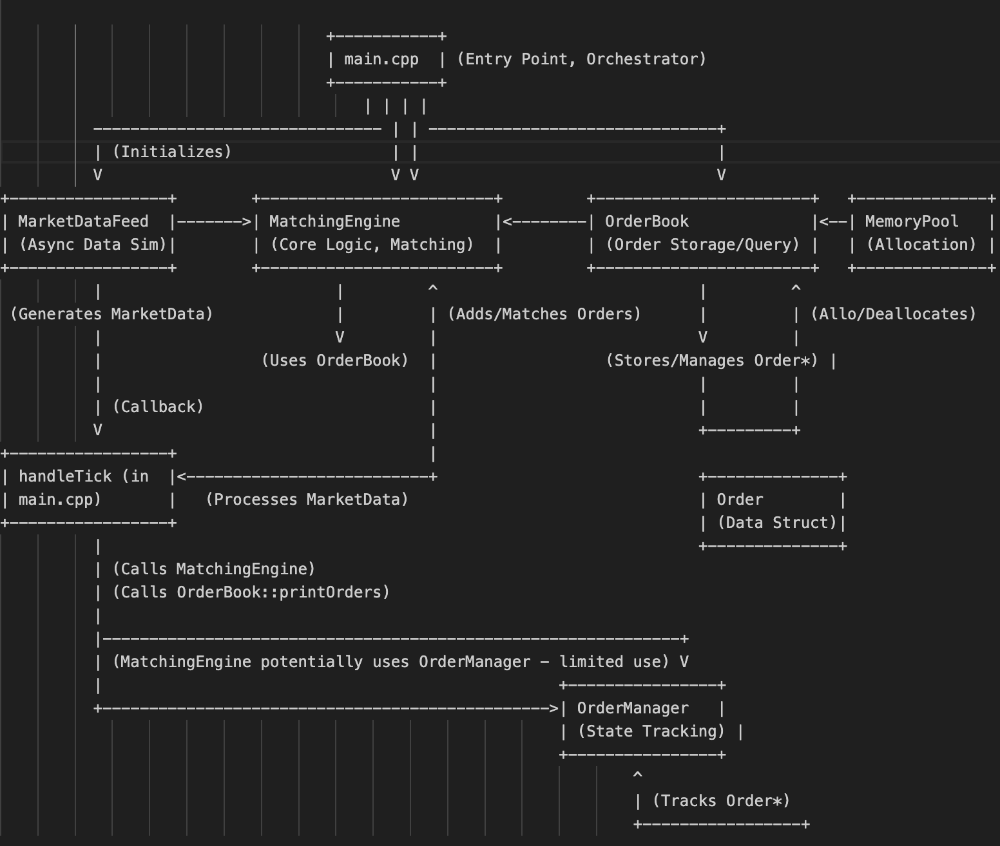

## Build Instructions

1.  **Build Steps**:
    # Build the project
    ```bash
    make
    ```
    # Clean up the project
    ```bash
    make clean
    ```
    This will create an executable file named `hft_app`. 

## ▶️ How to Run

1.  Execute the application:
    ```bash
    ./hft_app
    ```
    The application will start, and the Market Data Feed Simulator will begin generating ticks, printing them to the console. It will run for a while and then stop.

## to run the test latency cpp
  ```bash
    make clean
    make test
```

## Design Overview and Architecture
# HFT Trading System Prototype (C++)

## Overview

This project is a C++ prototype of a High-Frequency Trading (HFT) system. It simulates core components like market data processing, order book management, and order matching. The primary intention behind this design is to explore and demonstrate techniques commonly used in low-latency systems, prioritizing performance, even in this simplified model.

**Disclaimer:** This is a *prototype* trading system.

## Architecture

The system follows a modular architecture:

1.  **Market Data Feed (`MarketDataFeed`, `MarketData`)**:
    *   **Intention:** Simulates an external market data source.
    *   Generates `MarketData` ticks (symbol, bid, ask, timestamp) at configurable intervals in a separate thread.
    *   Uses a callback mechanism (`TickCallback`) to notify listeners (the `MatchingEngine` via `main.cpp`) of new ticks.
    *   `MarketData` struct holds the tick information, aligned for potential cache benefits.

2.  **Order Book (`OrderBook`, `Order`)**:
    *   **Intention:** Maintains the current state of resting limit orders for an instrument.
    *   Uses `std::multimap` to store buy (`bids_`) and sell (`asks_`) orders, sorted by price.
    *   Uses `std::unordered_map` (`ordersById_`) for quick lookup of orders by ID.
    *   Leverages the `MemoryPool` (via a custom deleter `OrderDeleter` with `std::shared_ptr`) for allocating/deallocating `Order` objects. The intention here is to manage `Order` object memory efficiently.

3.  **Memory Pool (`MemoryPool`)**:
    *   **Intention:** Provides fast, custom memory allocation for fixed-size objects (specifically `Order` objects in this design).
    *   Pre-allocates a large chunk of memory and manages it using a simple free list. Aims to reduce allocation latency and fragmentation compared to `new`/`delete`.

4.  **Order Manager (`OrderManager`)**:
    *   **Intention:** Tracks the lifecycle and state (`New`, `PartiallyFilled`, `Filled`, `Cancelled`) of orders submitted by the trading strategy or system.
    *   Provides functions to add, cancel, and update the fill status of orders. Uses an `std::unordered_map` for efficient access by order ID.

5.  **Matching Engine (`MatchingEngine`)**:
    *   **Intention:** Core logic unit responsible for processing market data and executing trades by matching buy and sell orders.
    *   Receives `MarketData` ticks.
    *   Interacts with the `OrderBook` to add new orders (in this simple implementation, it adds orders based on incoming market data) and find potential matches.
    *   Implements a basic price-time priority matching algorithm (crossing the spread). Iteration over the `std::multimap` naturally gives price priority, and the order of insertion within a price level provides a basic time priority simulation.

6.  **Main (`main.cpp`)**:
    *   **Intention:** Sets up the system components, links them together (registers the `handleTick` callback), starts the simulation, and manages its lifecycle.

## Core Features

*   **Simulated Market Data:** Generates tick data for specified symbols.
*   **Order Book Management:** Supports adding, deleting, and querying limit orders. Provides Best Bid/Offer (BBO).
*   **Custom Memory Allocation:** Uses a `MemoryPool` for `Order` objects to potentially improve performance.
*   **Basic Matching Logic:** Implements a simple matching algorithm for crossing orders based on price.
*   **Order State Tracking:** Rudimentary tracking of order status via `OrderManager`.
*   **Templated Design:** Flexible price and order ID types.
*   **Basic Concurrency:** Market data generation runs asynchronously.

## Performance Considerations

*   **`MemoryPool`:** Avoid `new`/`delete` overhead for `Order` objects.
*   **`std::multimap`:** Efficient BBO lookup and price-level iteration in `OrderBook`.
*   **`std::unordered_map`:** Fast O(1) average lookup by ID.
*   **`alignas(64)`:** Attempt at cache-friendly alignment for `MarketData`.
*   **`std::thread` / `std::atomic`:** Basic asynchronous data feed simulation.
*   **Minimal Copying:** Use of `std::move` where applicable.



1.  **`main.cpp` (Orchestrator):**
    *   **Intention:** To initialize and connect all the major components of the system and manage the overall application lifecycle.
    *   **Flow:**
        *   Creates instances of `MemoryPool`, `OrderBook` (providing pool size info), `MatchingEngine` (linking it to the `OrderBook`), `OrderManager`, and `MarketDataFeed`.
        *   Defines the `handleTick` callback function.
        *   Registers `handleTick` with the `MarketDataFeed`.
        *   Starts the `MarketDataFeed` thread.
        *   Waits (simulating system runtime).
        *   Stops the `MarketDataFeed`.

2.  **`MarketDataFeed` (Data Source Simulator):**
    *   **Intention:** To simulate an external feed providing market data ticks asynchronously.
    *   **Flow:**
        *   Runs in its own dedicated thread (`m_simulation_thread`).
        *   Periodically generates `MarketData` objects (containing symbol, bid, ask, timestamp).
        *   Invokes the registered callback (`handleTick` in `main.cpp`) passing the newly generated `MarketData`.

3.  **`handleTick` function (in `main.cpp`):**
    *   **Intention:** To act as the bridge receiving data from the feed and dispatching it to the core processing logic.
    *   **Flow:**
        *   Receives a `MarketData` object from `MarketDataFeed`.
        *   Calls `MatchingEngine::processMarketData` to handle the tick.
        *   Calls `OrderBook::printOrders` for visualization/debugging.

4.  **`MatchingEngine` (Core Logic):**
    *   **Intention:** To contain the trading strategy logic (albeit simple here) and the order matching algorithm.
    *   **Flow:**
        *   Receives `MarketData` via `processMarketData`.
        *   Generates new `Order` objects based on the market data (intending to simulate reacting to market changes).
        *   Calls `OrderBook::addOrder` to insert these new orders.
        *   Calls its own `matchOrders` method.
        *   Inside `matchOrders`:
            *   Accesses the best bids and asks from the `OrderBook` (`getBids`, `getAsks`).
            *   If orders cross (bid >= ask), it calculates the matched quantity.
            *   Updates the quantities of the matched `Order` objects (held within the `OrderBook`).
            *   Removes fully filled orders from the `OrderBook`'s bid/ask collections (`bids_.erase`, `asks_.erase`).
        *   Potentially adds more orders based on `OrderBook` state (`bestBid`, `bestAsk`).
        *   Potentially interacts with `OrderManager` to track submitted orders (e.g., `OrderManager::addOrder`).

5.  **`OrderBook` (Order Storage):**
    *   **Intention:** To efficiently store and manage resting limit orders, providing fast access to the best prices and allowing order addition/deletion.
    *   **Flow:**
        *   Receives requests to add orders (`addOrder`) from the `MatchingEngine`.
        *   Inside `addOrder`:
            *   Requests memory from its associated `MemoryPool` (`allocator_.allocate`).
            *   Constructs an `Order` object in the allocated memory.
            *   Stores a `shared_ptr` to the `Order` (with a custom deleter linked to the `MemoryPool`) in its internal `bids_` or `asks_` multimaps (sorted by price) and the `ordersById_` map.
        *   Provides access to bids/asks (`getBids`, `getAsks`) for the `MatchingEngine`.
        *   Handles order removal implicitly when `shared_ptr`s are erased from its maps during matching (triggering the custom deleter which calls `MemoryPool::deallocate`).
        *   Provides lookup methods (`bestBid`, `bestAsk`, `getOrderById`).

6.  **`MemoryPool` (Allocator):**
    *   **Intention:** To provide fast, low-overhead memory allocation/deallocation for fixed-size `Order` objects, avoiding standard heap allocation bottlenecks.
    *   **Flow:**
        *   Initialized by `OrderBook` (indirectly via `main.cpp` providing size info).
        *   Provides memory blocks via `allocate()` when requested by `OrderBook::addOrder`.
        *   Receives memory blocks back via `deallocate()` when the `OrderDeleter` (used by the `shared_ptr` in `OrderBook`) is invoked upon an `Order` object's destruction.

7.  **`OrderManager` (State Tracker):**
    *   **Intention:** To track the state (New, Filled, Cancelled, etc.) of orders originating from the system's strategy.
    *   **Flow:**
        *   Receives `OrderPtr` via `addOrder` (called potentially by `MatchingEngine`).
        *   Stores the order pointer and its initial state (`New`).
        *   Provides methods to update state (`updateOrderFill`, `cancelOrder`) 
        *   Provides methods to query order state (`getState`).

8.  **`Order` / `MarketData` (Data Structures):**
    *   **Intention:** Simple structures to hold data. `Order` holds details of a trading order. `MarketData` holds details of a market tick (aligned for potential cache performance).
    *   **Flow:** Instantiated and passed between the components described above.

=== Testing with 1000 ticks ===

Running latency test with aligned market data 1000 ticks...

Aligned marketdata test Statistics (nanoseconds):
Min: 83
Max: 368292
Mean: 1016.34
StdDev: 12836.8
P50: 208
P95: 458
P99: 9167

Running unaligned test with 1000 ticks...

Unaligned MarketData Test Statistics (nanoseconds):
Min: 83
Max: 2625
Mean: 221.359
StdDev: 177.999
P50: 208
P95: 292
P99: 1084

=== Testing with 10000 ticks ===

Running latency test with aligned market data 10000 ticks...

Aligned marketdata test Statistics (nanoseconds):
Min: 83
Max: 138208
Mean: 253.476
StdDev: 1522.91
P50: 208
P95: 333
P99: 1125

Running unaligned test with 10000 ticks...

Unaligned MarketData Test Statistics (nanoseconds):
Min: 83
Max: 66292
Mean: 270.782
StdDev: 761.109
P50: 209
P95: 458
P99: 1250

=== Testing with 100000 ticks ===

Running latency test with aligned market data 100000 ticks...

Aligned marketdata test Statistics (nanoseconds):
Min: 83
Max: 1166042
Mean: 373.413
StdDev: 4323.35
P50: 209
P95: 875
P99: 1458

Running unaligned test with 100000 ticks...

Unaligned MarketData Test Statistics (nanoseconds):
Min: 83
Max: 2303875
Mean: 471.543
StdDev: 7316.21
P50: 250
P95: 1042
P99: 1667

Across all loads, aligned vs. unaligned medians sit at ~208–250 ns. This indicates that for the bulk of ticks, cache-line alignment has little effect on “typical” processing cost. At 1 000 ticks, aligned P99 (9 167 ns) is nearly 8× the unaligned P99 (1 084 ns), which is an anomaly caused by a few extremely slow ticks (perhaps due to cache thrashing or page crossing). As load increases, aligned P99 (1 458 ns at 100 000 ticks) remains lower than unaligned P99 (1 667 ns), and aligned max (1.17 ms) is roughly half the unaligned max (2.30 ms). At low load (1 000 ticks), aligned mean (1 016 ns) is inflated by the worst outliers, whereas unaligned mean (221 ns) stays close to median. At higher loads (100 000 ticks), means converge (373 ns vs. 472 ns), suggesting the relative impact of occasional very slow aligned ticks diminishes but still favors aligned overall. Both layouts see mean latency decrease from 1 000 to 10 000 ticks (likely warm-up effects) then increase slightly by 100 000 ticks (due to cache contention or allocator pressure). Unaligned mean grows more steeply at high volume (+201 ns from 10 000→100 000) than aligned (+119 ns), showing alignment’s resilience under stress. In general, cache-line alignment delivers significant tail-latency improvements, cutting worst-case stalls by up to half under heavy load. 
